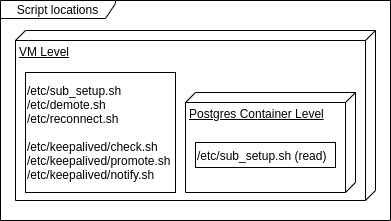

# Executables

## Full Workflow

First the cluster must be created. Either by getting the Vagrant Boxes or by using an existing cluster. Both variants may will need more or less reconfiguring. After that the setup script can be executed to prepare the cluster for the upcoming interaction. At last the test client can be executed, but its recommended to first prepare the cluster by executing the setup script which will execute the test client in the end.

## Rolling Upgrade

### First Time / Prepare Rolling Upgrade 
The Rolling Upgrade only works with the image presented in the ../custom_images/ folder.
This is due to the usage of logical replication via pglogical2. 

Before executing the rolling upgrade for the first time in a cluster introduce logical replication via pglogical2! There are at least these four ways to be executed to replace container one by one. For these they will use the term "old" for the postgres without pglogical2 and "new" for postgres image including pglogical2. Finally, this means only that pglogical2 is introduced to the cluster, the postgres major version should NOT change.

- Reuse the Volume / Mount
    - Downtime: Yes (at least Write Access), to ensure that no data is written and then lost (due to stop).
    - Sequence:
        - Stop the old container
        - Start the new container and reuse old mount
- Get state via pg_basebackup
    - Downtime: Yes, same as above.
    - Sequence: 
        - Start new container with pg_basebackup to get state from existing container.
        - When new container is up, stop old container
- Install pglogical
    - Downtime: Zero Downtime possible
    - Sequence:
        - Install pglogical on old container
        - Start pglogical provider on old container
        - Start new container, but check that the set ip is set to old container with pglogical!
        - Stop old container, when replication is up-to-date
    - TODO: Not sure if physical replication (if existent in old container, new to old) and logical replication (new to new) can work side by side.
- Setup physical replication
    - Downtime: Zero Downtime possible
    - Sequence:
        - Start new container, may need pg_basebackup
        - Connect new container to old container for physical replication
        - Stop old container, when replication is up-to-date
    - TODO: Not sure if physical replication (new to old) and logical replication (new to new) can work side by side.

### Execute Rolling Ugrade
To perform a rolling upgrade, execute rolling_upgrade.sh.

How to use:
- Execute with normal shell in this folder `./rolling_upgrade.sh`
- Phase 1: Then you will be prompted to enter a subscriber name, it is in the form like `pg95_db.1`. This subscriber will be the first that is upgraded to the new version (v10).
- Phase 2: After you pressed `enter` to continue, the other subscriber will be upgraded.
- Phase 3: After you pressed `enter` to continue, the provider will be upgraded and the rolling upgrade comes to an end.

Following the configuration | how to adjust it:
- Docker Swarm Nodes / Hosts
    - all hosts' root users are reachable via ssh on port 22 | If another port is used for SSH, change ssh command at `ssh_scp.sh`.
    - ssh authenticates to hosts via ssh keys in the `keys` folder | TODO
    - hosts IPs | Adjustable in the .env.sh file
    - Keepaliveds VIP & interface and `sub_setup.sh:get_ip` must be matched with what is running on the postgres machines! | TODO
    - there are at maximum three hosts | TODO
- Postgres Cluster
    - There is only one provider per Cluster | TODO
    - There are 0 or more subscriber per Cluster | TODO
    - old version is 9.5.18 | Change would affect Images and parts of the script thats checks the postgres version
    - new version is 10.13 | Change would affect Images and parts of the script thats checks the postgres version
    - Postgres Images need to have pglogical2 installed | No way around that without massive changes
- Upgrade Process
    - Scripts expects to only start a new versioned postgres after an old version postgres is shutdown. At any given moment in the time the total number of postgres instances do not change. | Change behaviour in `rolling_upgrade.sh`.
    - Scripts expect the provider to be the last instance that is upgraded. | TODO
    - The script is only tested in linux | May need additional installs to work, but which exactly is TODO.
- Docker Stacks:
    - Tested version does only include anonymous mounts! | TODO
    - The script and stacks will expect certain executable scripts from the `postgres` and `keepalived` folders at certain locations on the hosts, have a look at: . The placement inside the container is done via the stacks. | TODO
    - Scripts uses the docker node label `pg_ver` to mark where to run which version | TODO
    - old version stack is deployed with the name `pg95` and the postgres service is called `db` and the network is called `pgnet` | Change any occurence of the mentioned values in the code and stack file to the wanted text.
    - new version stack is deployed with the name `pg10` and the postgres service is called `db` and the network is called `pgnet` | Change any occurence of the mentioned values in the code and stack file to the wanted text.

## Setup, Testing, Developing

The logical center of execution is the setup.sh script.

Usage (setup.sh -h):
```
This script sets up the environment (machines and docker swarm) to start a PostgreSQL Cluster for certain experiments.
--------------------
Flags:
-m  will start the VMs first (Only works on MacOS and Linux with VirtualBoxManager so far).
-s  will initialize the swarm cluster ontop of the running VMS.
-p  will start the postgres cluster <als letztes>.
-h  will print this help
```

To start up the full cluster execute `setup.sh -msp`, to only e.g. reset Postgres container only execute `setup.sh -p`. This will setup & start the VMs, Docker Swarm, Keepalived and Postgres containers. The full execution `-msp` may take a few minutes, the most time is needed when the `-p` flag is set.

After the start setup.sh will source test_client.sh. For more info on that have a look into helper_scripts/README.md

Configuration additionally to the listed in rolling upgrade:
- Must match existing virtualbox instance names | TODO
- hostnames are fixed | Rename in virtualbox and replace hostnames in text with new one.

## Virtual Machines

The VMs in use are setup by the `vm_setup.sh` script, that may be replaced with configuration tooling in the future. It e.g. sets firewall rules, sets certain hostnames and checks connectivity to the internet. This script is more of collection of notes in bash form. 

More interesting is the `vms.sh` script which is e.g. able to check if the VMs are started and shut them down. More detailed information including flags, have a look at `vms.sh -h`.

## Testing

Tests are written in [bats](https://github.com/sstephenson/bats).
