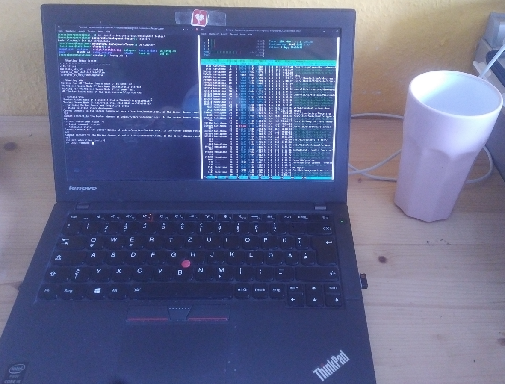

<!--
Testrunde 1, ca 30 Minuten:
Existierende Lösung:  3:12
Anforderungen1: 1:08
Anforderungen2: 2:39
Lösungen: 2:15
Sub Upgrade: 2:32
Prov Upgrade: 5:09
InPlace: 2:31
Services: 2:55
Testbed 1:22
Testszenario & tool 3:07
Zusammenfassung + Zukunft: 2:33
-->

<!-- 
_header: ""
_footer: ""  
_paginate: false
_class: lead
-->

# **Zero Downtime**

**PostgreSQL High Availability**
*Zero Downtime Upgrade*

---

---

# **Gliederung**
- Problem
- Lösung 
- Zusammenfassung 
- Zukünftige Arbeit

<!--
- Problem (20 Min)
    - Kontext (6 Min)
    - Existierende Lösungen (7 Min)
    - Anforderungen (7 Min)
- Lösung (33 Min)
    - Lösungen (23 Min)
    - Testing (10 Min)
- Zusammenfassung (5 Minuten)
- Zukünftige Arbeit (2 Minuten)
-->

---

# **Kontext**

- (Verbessertes) HA Cluster in Docker Swarm 
- PostgreSQL v9.5
- Upgrade in HA Environments:
    - Zero Downtime
    - **Rolling Upgrade**
    - Blue/Green Deployment

<!--
Vergleich Rolling <-> Blue/Green
    - Blue/Green braucht mehr Resourcen
-->

---

# **Existierende Lösungen**

- **Spilo/Patroni/Stolon/Zalando PO**: Nur mit Kubernetes
- **CrunchyData Container**: Keine Logische Replikation
- **ClusterControl**: PostgreSQL v9.6 oder höher
- **Bucardo**: Interessant, aber zu spät gesehen

<!-- 
- CrunchyData Container: Bereits in Verwendung für normales HA Deployment, allerdings keine Logische Replikation!
- ClusterControl: Only works with v9.6 or higher.
- Bucardo (Keine Info zu Upgrade Prozess aber sieht interessant aus, leider zu spät gesehen: https://bucardo.org/Bucardo/index.html)
- BDR (Kostenpflichtig)
- Citus (No Info if workes with V9.5)
- Zalando PO=PostgresOperator/Spilo/Patroni/Stolon (only works with Kubernetes/Helm)
-->
---

# **Anforderungen**

|ID|Blickwinkel|Must-Have Anforderung              |
|--|-----------|-----------------------------------|
|M1|Aufgabe    |Zero Downtime Upgrade              |
|M2|Tech       |PostgreSQL limitationen            |
|M3|Tech       |Docker (Swarm) limitationen        |
|M4|Kunde      |Keine Schwächung der HA-Eigenschaft|
|M5|Kunde      |Kein Datenverlust                  |

---

# **Anforderungen**

|ID|Blickwinkel|Should- & Nice-To-Have Anforderung                    |
|--|-----------|-------------------------------------------|
|S1|Kunde      |Keine Internet Connection während Upgrade  |
|S2|Kunde      |Unmodifiziertes PostgreSQL Image           |
|S3|Maintainer |PostgreSQL Version je Container transparent|
|S4|Maintainer |Möglichst leicht umzusetzen / zu warten    |
|N1|Kunde     |Möglichst geringe Upgradedauer             |

<!--
Maintainer = Wir / Nachtblau
-->

---

# **Lösungen**
- Rolling Upgrade
- Externes "Upgrader" Skript

<!--
- Zuerst nach und nach Subscriber upgraden
- Zuletzt Provider Upgrade
    - Provider v9.5 upgraden -> Subscriber v10
    - Subscriber v10 befördern -> Provider v10
- pglogical2 für Logische Replikation in v9.5
-->

---

<!--
_footer: ""
-->

---
<!--
_footer: ""
-->

---

<!--
_header: "**InPlace**"
-->

<!--
Nur Vorstellen, noch nicht vergleichen!
-->

---
<!--
_header: "**Services**"
-->

<!--
Nur Vorstellen, noch nicht vergleichen!
-->

---
# **Testbed**

<!--
- 2 VirtualBox VM (1 Core, 1GB Ram)
    - CentOS 7
    - Docker v19.03.8
    - PostgreSQL v9.5.18 & v10.13
-->

---
# **Testszenarios**

- 1 Provider & 1 Subscriber
- Test 1: Major Upgrade eines Subscribers 
- Test 2: Major Upgrade des Clusters

<!--
- Alle Tests starten mit einem Provider und einem Subscriber inklusive Check ob Replikation so funktioniert wie sie soll.
- Test_1: Prüfe, ob die vom Testtool erkannten Rollen auch die realen Rollen (Provider/Subscriber) sind.
- Test_2: Prüfe, ob nach Subscriber Crash, neuer Subscriber auch die alten Daten erhält.
- Test_3: Prüfe, ob nach Provider Crash, neuer Provider tatsächlich von dem Subscriber als Provider erkannt wird.
- Test_4: Prüfe, ob nach Provider Crash, neuer Provider die alten Daten hat.
- Up_Test1: Prüfe, ob Major Upgrade eines Subscribers Probleme verursacht (z.b. Crash, Verlust alter Daten)
- Up_Test2: Prüfe, ob Major Upgrade des Clusters Probleme verursacht (z.b. Crash, Verlust alter Daten)
-->

---
# **Testtool**
- in Bash
- Vereinfacht & Automatisiert
    - Setup / Teardown
    - Testszenarios
    - Provozieren von Fehlern
    - ...

<!--
- Live Vorführung?
- VMs, Docker, Postgres, Keepalived (z.b. starten & stoppen, lesen von Logs, updaten der Dateien & Konfigurationen)
-->

---

# **Zusammenfassung**
- InPlace (Done & Tested)
    - Nicht erfüllte Anfoderungen: Internet (S1), 
      Modifikationen (S2), Intransparenz (S3), Workarounds (S4)
- Seperate Services (Wird implementiert)
    - Nicht erfüllte Anfoderungen: ggf. Langsam (N1)
- Confluence

<!--
- Welche Lösung wird nun implementiert & getestet?
    - Externer: Scheiterte an Machbarkeit wegen Docker Limitationen (Neustart nach Upgrade mit altem Container -> nutzt alte Binarys und Daten)
    - Sep Services: Kam vor 2 Wochen als Idee auf, als InPlace schon fertig war
- wirklich valide Lösungen?
-->

---
# **Zukünftige Arbeit**
- Implementation fertigstellen
- Eigene Lösung verbessern: Refactoring, mehr Tests (Unit & Integration)
- Ausprobieren von Bucardo
- Upgrade Dauer und Downtime implementierter Lösungen messen & vergleichen
--- 
<!--  
_header: ""
_paginate: false 
_footer: ""
-->

# **Thanks for Listening**

**Michael Müller**
_Zero Downtime Upgrading_

<!--The End-->