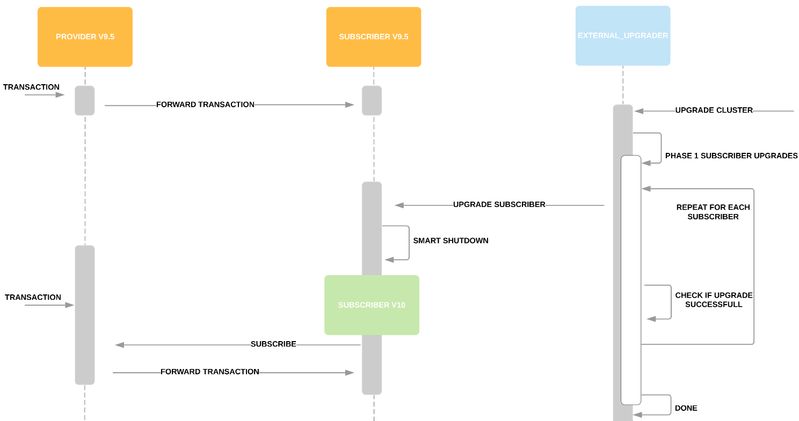
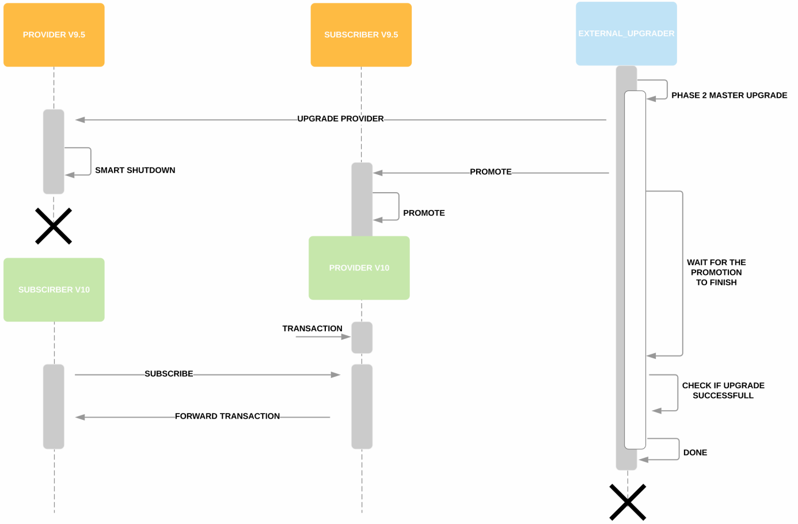
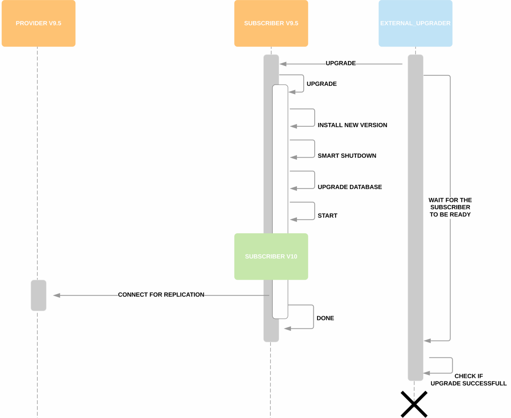
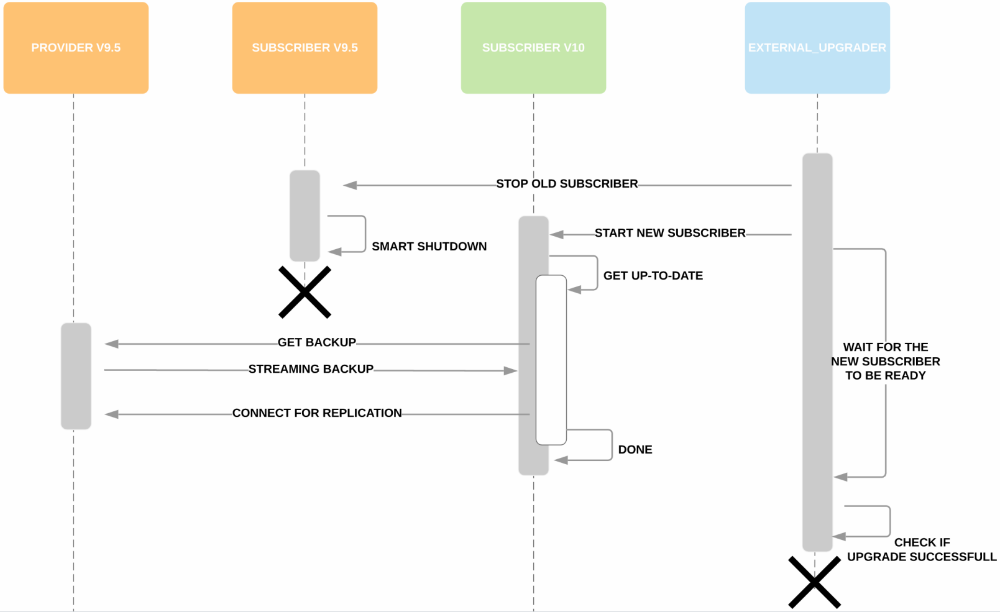

<!-- 
_header: ""
_footer: ""  
_paginate: false
_class: lead
-->

# **Zero Downtime**

**PostgreSQL High Availability**
*Zero Downtime Upgrade*

---

---
<!-- _footer: " | **Michael Müller** - _Zero Downtime Upgrading_ // Quelle oder Hinweis" -->

# **Aufgabenstellung (+Intro 2 Minuten)**

- TODO Alle Folien in 10 Sekunden verständlich?
- TODO Insgesamt 60 Minuten? 
- TODO Wenn Final, Zeiten in Kommentare und Gruppierung (Wort vor "-") streichen.
- PostgreSQL HA Environment
- Zero Downtime Upgrading 
- IT-Security nicht im Mittelpunkt

---

# **Problem - Context (6 Minuten)**

- (Verbessertes) HA Cluster in Docker Swarm 
- PostgreSQL v9.5
- Upgrade in HA Environments:
    - Zero Downtime
    - **Rolling Upgrade**
    - Blue/Green Deployment

<!--
Vergleich Rolling <-> Blue/Green
    - Blue/Green braucht mehr Resourcen
-->

---

# **Problem - Existierende Lösungen (5 Minuten)**

- **Spilo/Patroni/Stolon/Zalando PO**: Nur mit Kubernetes
- **CrunchyData Container**: Keine Logische Replikation
- **ClusterControl**: PostgreSQL v9.6 oder höher
- **Bucardo**: Interessant, aber zu spät gesehen

<!-- 
- CrunchyData Container: Bereits in Verwendung für normales HA Deployment, allerdings keine Logische Replikation!
- ClusterControl: Only works with v9.6 or higher.
- Bucardo (Keine Info zu Upgrade Prozess aber sieht interessant aus, leider zu spät gesehen: https://bucardo.org/Bucardo/index.html)
- BDR (Kostenpflichtig)
- Citus (No Info if workes with V9.5)
- Zalando PO=PostgresOperator/Spilo/Patroni/Stolon (only works with Kubernetes/Helm)
-->
---

# **Problem - Anforderungen (7 Min)**

|ID|Blickwinkel|Must-Have Anforderung              |
|--|-----------|-----------------------------------|
|M1|Aufgabe    |Zero Downtime Upgrade              |
|M2|Tech       |PostgreSQL limitationen            |
|M3|Tech       |Docker (Swarm) limitationen        |
|M4|Kunde      |Keine Schwächung der HA-Eigenschaft|
|M5|Kunde      |Kein Datenverlust                  |

---

# **Problem - Anforderungen (7 Min)**

|ID|Blickwinkel|Should- & Nice-To-Have Anforderung                    |
|--|-----------|-------------------------------------------|
|S1|Kunde      |Keine Internet Connection während Upgrade  |
|S2|Kunde      |Unmodifiziertes PostgreSQL Image           |
|S3|Maintainer |PostgreSQL Version je Container transparent|
|S4|Maintainer |Möglichst leicht umzusetzen / zu warten    |
|N1|Kunde     |Möglichst geringe Upgradedauer             |

<!--
Maintainer = Wir / Nachtblau
-->

---

# **Solution - Lösungen (5 Minuten)**
- Rolling Upgrade
- Externes "Upgrader" Skript

<!--
- Zuerst nach und nach Subscriber upgraden
- Zuletzt Provider Upgrade
    - Provider v9.5 upgraden -> Subscriber v10
    - Subscriber v10 befördern -> Provider v10
- pglogical2 für Logische Replikation in v9.5
-->

---

<!--
_footer: ""
-->

---
<!--
_footer: ""
-->

---

# **Solution - Lösungen**

- TODO Folie nicht zeigen, nur für Organisation
- InPlace (5 Minuten)
- Seperate Services (5 Minuten)

---

<!--
Nur Vorstellen, noch nicht vergleichen!
-->

---

<!--
Nur Vorstellen, noch nicht vergleichen!
-->

---

# **Vergleich der Lösungen (8 Minuten)**

- **InPlace** (Done & Tested)
    - Nicht erfüllte Anfoderungen: S1, S2, S3, S4
- **Seperate Services** (Wird implementiert)
    - Nicht erfüllte Anfoderungen: ggf. N1
- TODO Sind die Lösungen wirklich valide?

<!--
- Welche Lösung wird nun implementiert & getestet?
    - Externer: Scheiterte an Machbarkeit wegen Docker Limitationen (Neustart nach Upgrade mit altem Container -> nutzt alte Binarys und Daten)
    - Sep Services: Kam vor 2 Wochen als Idee auf, als InPlace schon fertig war
-->
---
# **Testbed (2 Minuten)**
- 2 VirtualBox VM (1 Core, 1GB Ram)
    - CentOS 7
    - Docker v19.03.8
    - PostgreSQL v9.5.18 & v10.13
- 1 Provider / 1 Subscriber
---
# **Testszenarios (5 Minuten)**

- Test 1: Major Upgrade eines Subscribers 
- Test 2: Major Upgrade des Clusters

<!--
- Alle Tests starten mit einem Provider und einem Subscriber inklusive Check ob Replikation so funktioniert wie sie soll.
- Test_1: Prüfe, ob die vom Testtool erkannten Rollen auch die realen Rollen (Provider/Subscriber) sind.
- Test_2: Prüfe, ob nach Subscriber Crash, neuer Subscriber auch die alten Daten erhält.
- Test_3: Prüfe, ob nach Provider Crash, neuer Provider tatsächlich von dem Subscriber als Provider erkannt wird.
- Test_4: Prüfe, ob nach Provider Crash, neuer Provider die alten Daten hat.
- Up_Test1: Prüfe, ob Major Upgrade eines Subscribers Probleme verursacht (z.b. Crash, Verlust alter Daten)
- Up_Test2: Prüfe, ob Major Upgrade des Clusters Probleme verursacht (z.b. Crash, Verlust alter Daten)
-->
---
# **Testtool (5 Minuten)**
- in Bash
- Hilft beim hoch- / herunterfahren des Testbeds in 3 Stufen (VMs, Docker, Postgres)
- Vereinfacht häufig genutzte Interaktion mit VMs, Docker, Postgres, Keepalived (z.b. lesen von Logs)
- Startet Testszenarios

<!--
- Live Vorführung?
-->
---
# **Conclusion (3 Minuten)**
- Tolles und facettenreiches Thema
- Valide Lösungen gefunden
- Detailierte Infos in Confluence
- IT-Security teilweise einfach nachrüstbar

<!--
Nach Research und etwas Trial & Error valide Lösungen gefunden

IT-Security nachrüstbar z.b. mit Postgres Passwörtern
-->

---
# **Zukünftige Arbeit (2 Minuten)**
- Implementation fertigstellen
- Ausprobieren von Bucardo
- Eigene Lösung verbessern: Refactoring, mehr Tests (Unit & Integration)
- Upgrade Dauer und Downtime implementierter Lösungen messen & vergleichen
--- 
<!--  
_header: ""
_paginate: false 
_footer: ""
-->

# **Thanks for Listening**

**Michael Müller**
_Zero Downtime Upgrading_

<!--The End-->